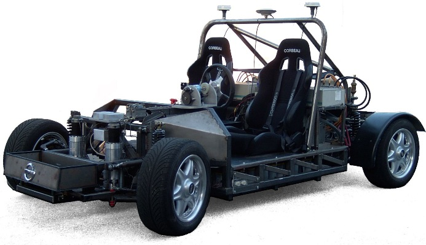
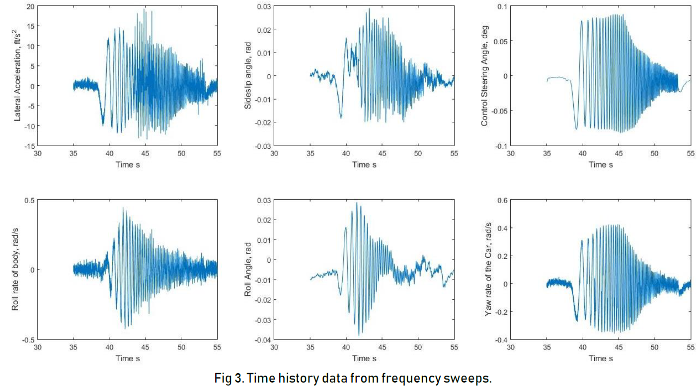
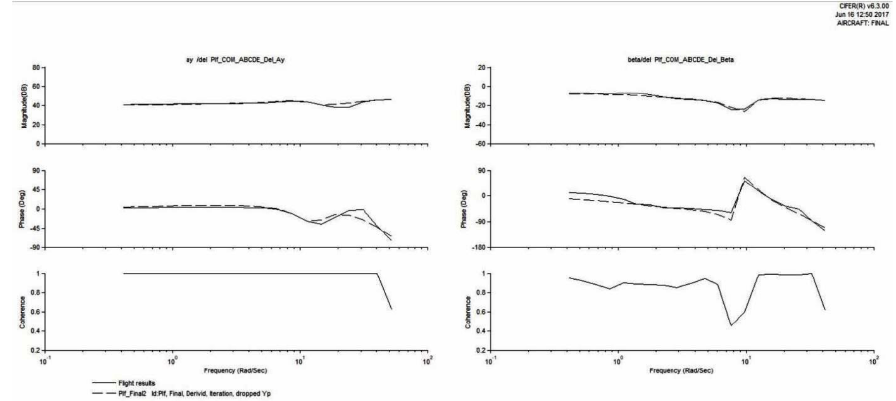
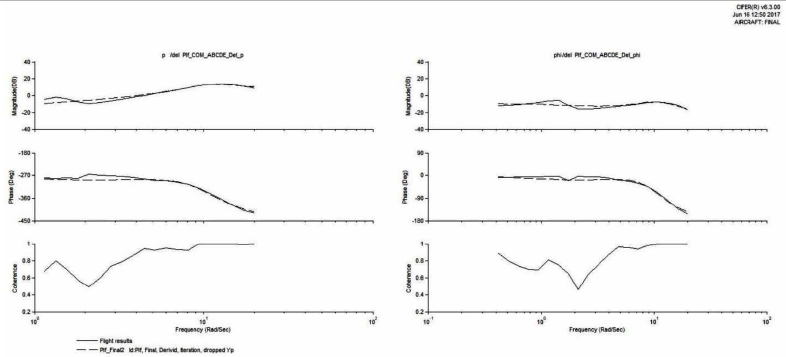
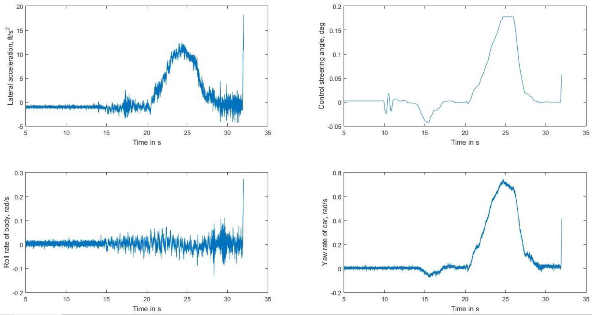

## SYSTEM IDENTIFICATION

This is a project done for "Mech 296A Special Topics in Dynamics and Control: System Identification" at Santa Clara University.

  The report has a general overview of the processes involved in frequency based system identification and application of the technique on Stanford research P1 vehicle.
  
  The Stanford P1 prototype steer-by-wire vehicle is an electric vehicle featuring independent left and right steering mechanisms and independent electric rear-wheel drive.

  Using the real test data of P1, 3 degrees of freedom lateral-directional model of the vehicle was identified, and was verified using time domain verification method.
  
  The provided data were collected on the real vehicle; system identification maneuvers were performed on the runway at NASA Ames research center.  
  
  <table align="center" border="0">
  <tr>
    <th>
      

           
            <a href="https://github.com/KarthickPN/System-Identification" name="p1_code">Stanford P1 Drive-by-wire vehicle </a>
        

    </th>
    <th>
      

           
            <a href="https://github.com/KarthickPN/System-Identification" name="p1_code">Time history data </a>
        

    </th>
  </tr>
  <tr>
    <th>
      

           
            <a href="https://github.com/KarthickPN/System-Identification" name="p1_code">Identified frequency overlaid on state space model </a>
        

    </th>
    <th>
      

           
            <a href="https://github.com/KarthickPN/System-Identification" name="p1_code">Identified frequency overlaid on state space model </a>
        

    </th>
  </tr>
 </table>
 

[Time Domain Verification](https://github.com/KarthickPN/System-Identification)

 
  # The Software
  
   Frequency based System Identification software CIFER was used.
    
   CIFER® Student Version is available for download from the AIAA Supplemental Materials website, upon purchase of Aircraft and Rotorcraft System Identification: Engineering Methods with Flight-Test Examples, Second Edition by Dr. Mark B. Tischler and Mr. Robert K. Remple. The download password can be found on the last printed page of the texbook, after the index.
    
   For more info about the software and the installation process, visit http://nams.usra.edu/flight-control/cifer/overview/
